# ChromaDB System Flow Diagram

## Complete Workflow Visualization

```mermaid
flowchart TD
    Start([Start: ChromaDB Demo]) --> Step1[Step 1: Installation]
    
    Step1 --> VEnv[Create Virtual Environment<br/>python3 -m venv venv]
    VEnv --> Activate[Activate Environment<br/>source venv/bin/activate]
    Activate --> Install[Install ChromaDB<br/>pip install chromadb]
    
    Install --> Step2[Step 2: Initialize ChromaDB]
    Step2 --> Client{Choose Client Type}
    Client -->|Temporary| InMemory[chromadb.Client<br/>In-Memory Storage]
    Client -->|Permanent| Persistent[chromadb.PersistentClient<br/>Disk Storage]
    
    InMemory --> CreateColl[Create/Get Collection<br/>get_or_create_collection]
    Persistent --> CreateColl
    
    CreateColl --> Step3[Step 3: CRUD on Data]
    
    Step3 --> Create[CREATE: Add Documents<br/>collection.add]
    Create --> Read[READ: Query Documents<br/>collection.query]
    Read --> Update[UPDATE: Modify Documents<br/>collection.upsert]
    Update --> Delete[DELETE: Remove Documents<br/>collection.delete]
    
    Delete --> Step4{Step 4: Need Persistence?}
    Step4 -->|Yes| SaveData[Save to ./chroma_db/<br/>Auto-saved with PersistentClient]
    Step4 -->|No| Step5
    SaveData --> Step5[Step 5: Manage Collections]
    
    Step5 --> ListColl[List Collections<br/>list_collections]
    ListColl --> ModifyColl[Modify Collection<br/>modify name/metadata]
    ModifyColl --> DeleteColl[Delete Collection<br/>delete_collection]
    
    DeleteColl --> Step6{Step 6: Advanced Features?}
    Step6 -->|Yes| OpenAI[Use OpenAI Embeddings<br/>text-embedding-3-small]
    Step6 -->|No| End
    
    OpenAI --> Token[Count Tokens<br/>tiktoken library]
    Token --> Enhanced[Enhanced Search Results<br/>with OpenAI Model]
    
    Enhanced --> End([End: Production Ready])
    
    style Start fill:#e1f5e1
    style End fill:#e1f5e1
    style Step1 fill:#fff4e6
    style Step2 fill:#e3f2fd
    style Step3 fill:#f3e5f5
    style Step4 fill:#fff3e0
    style Step5 fill:#e0f2f1
    style Step6 fill:#fce4ec
    style OpenAI fill:#ffebee
```



## Quick Reference: Key Components

### 🔧 Core Components
1. **ChromaDB Client**: The main interface (in-memory or persistent)
2. **Collection**: A container for related documents (like a database table)
3. **Documents**: The text content you want to search
4. **Embeddings**: Numerical representations of text meaning (auto-generated)
5. **Metadata**: Extra information to filter and organize documents

### 📊 CRUD Operations

**On Data (Documents):**
- **Create**: `collection.add()` - Add new documents
- **Read**: `collection.query()` - Search using natural language
- **Update**: `collection.upsert()` - Update or insert documents
- **Delete**: `collection.delete()` - Remove documents by ID

**On Collections:**
- **Create**: `get_or_create_collection()` - Create new collection
- **Read**: `list_collections()` - View all collections
- **Update**: `collection.modify()` - Rename or update metadata
- **Delete**: `delete_collection()` - Remove entire collection

### 🎯 Use Case Example
**Scenario**: Company Travel Policy Management
- Store multiple policy documents (flights, hotels, car rentals)
- Ask questions in natural language: "What's the hotel budget?"
- Get relevant answers based on meaning, not just keywords
- Update policies as they change
- Save permanently for future use

---

## How to Use This Diagram in PowerPoint

### Option 1: Mermaid Live Editor (Recommended)
1. Go to https://mermaid.live/
2. Copy the mermaid code (between the ```mermaid``` tags)
3. Paste it into the editor
4. Click "Download PNG" or "Download SVG"
5. Insert the image into your PowerPoint slide

### Option 2: VS Code Extension
1. Install "Markdown Preview Mermaid Support" extension in VS Code
2. Open this file in VS Code
3. Press `Cmd+Shift+V` to preview
4. Take a screenshot of the diagram

### Option 3: Online Converter
1. Use https://www.mermaidchart.com/
2. Paste the diagram code
3. Export as image for PowerPoint

---

## Simplified Text Version (For Quick Reference)

```
[START] 
   ↓
[1. INSTALL] → Virtual Env → Activate → pip install chromadb
   ↓
[2. INITIALIZE] → Choose: In-Memory OR Persistent → Create Collection
   ↓
[3. CRUD DATA] → Add → Query → Update → Delete
   ↓
[4. PERSISTENCE] → Save to disk (optional)
   ↓
[5. MANAGE COLLECTIONS] → List → Modify → Delete
   ↓
[6. ADVANCED] → OpenAI Embeddings → Token Counting
   ↓
[END - Production Ready]
```

